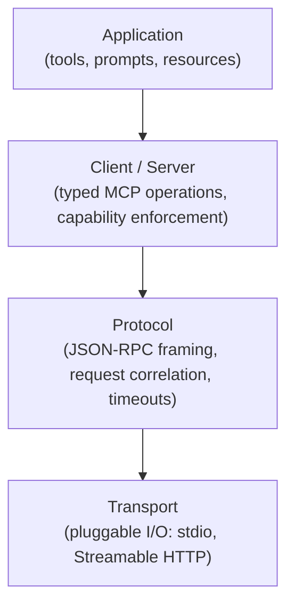
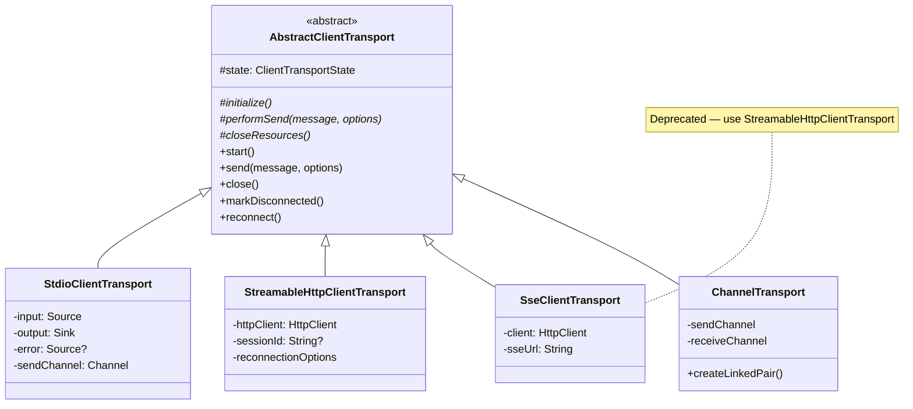
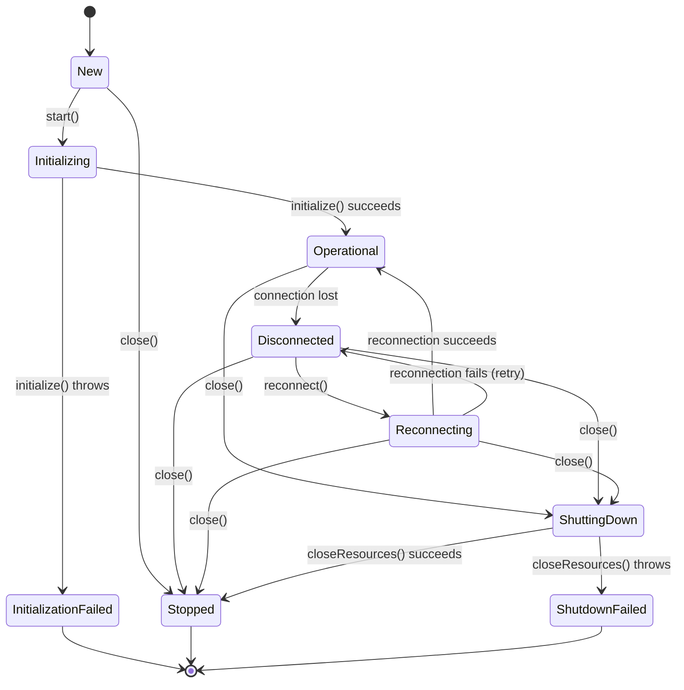
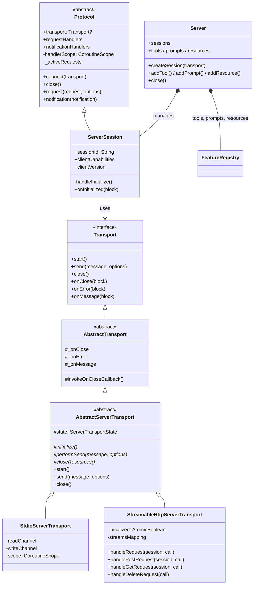
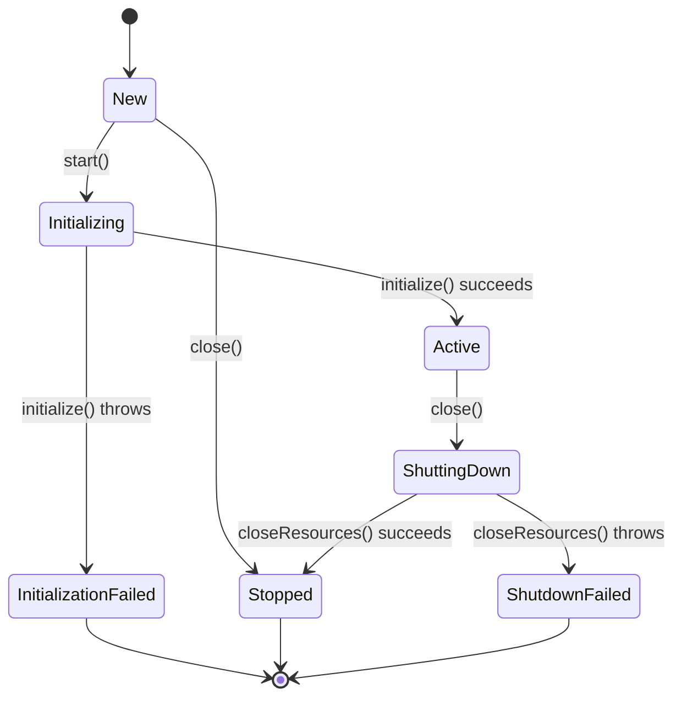
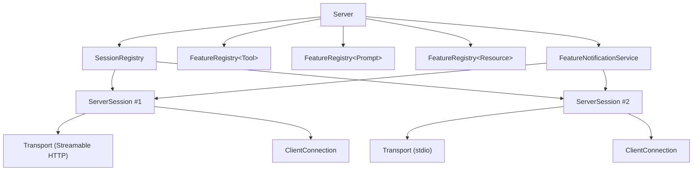
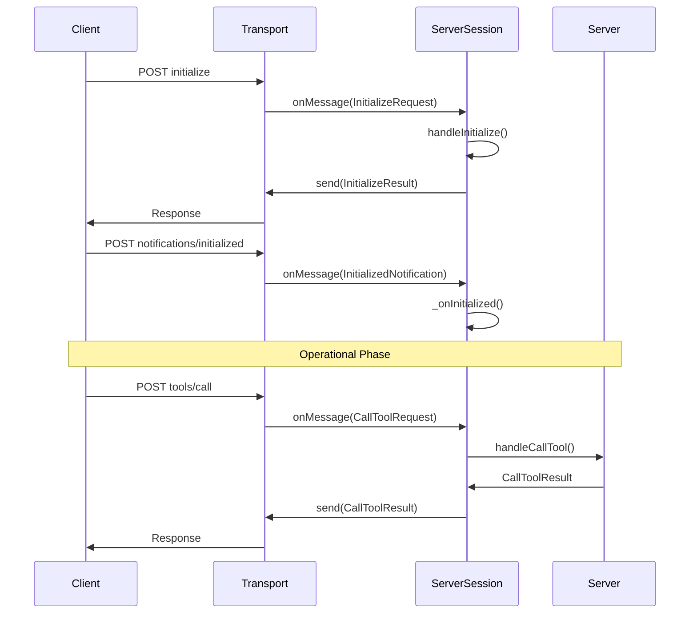
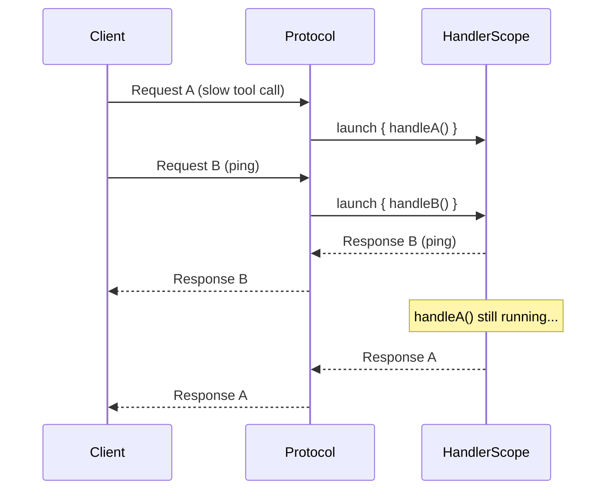
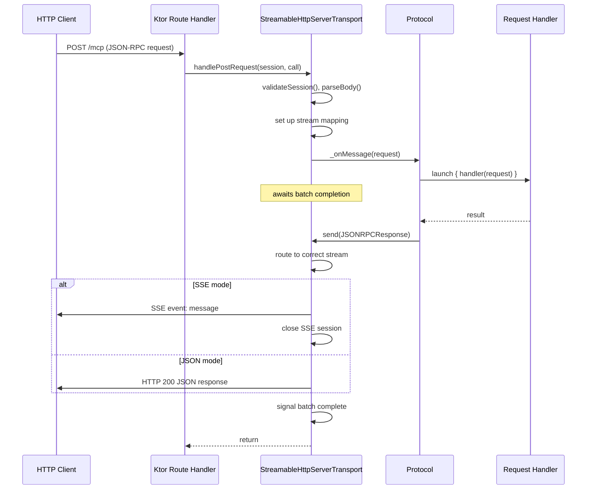

# Architecture

This document describes the internal architecture of the MCP Kotlin SDK. It covers both client and server sides, the transport abstraction, state management, and concurrency model. All diagrams use Mermaid syntax and render in GitHub, IntelliJ, and most Markdown viewers.

## Layered Design

The SDK follows a four-layer architecture where each layer has a single responsibility and communicates only with its immediate neighbors.

**Application** registers tools, prompts, and resources (server-side) or calls them (client-side). This is where your code lives.

**Client / Server** provides typed MCP operations — `callTool()`, `listResources()`, `createMessage()` — and enforces capability negotiation. You don't send raw JSON-RPC here; the layer maps high-level calls to protocol messages and validates that both sides advertised the required capabilities.

**Protocol** handles JSON-RPC framing: request/response correlation by ID, timeouts, progress notifications, and cancellation. It's transport-agnostic — it just calls `transport.send()` and reacts to `transport.onMessage()`.

**Transport** moves bytes. It knows about stdio pipes, HTTP connections, or SSE streams, but nothing about MCP semantics.

This layering means you can swap transports without touching application code, and you can test the protocol layer with an in-memory `ChannelTransport` that never opens a socket.

## Module Structure

| Module | Contents |
|--------|----------|
| `kotlin-sdk-core` | `Transport` interface, `AbstractTransport`, `AbstractClientTransport`, `Protocol` base class, JSON-RPC types, `ClientTransportState` |
| `kotlin-sdk-client` | `Client`, client transports (`StdioClientTransport`, `StreamableHttpClientTransport`, `SseClientTransport`) |
| `kotlin-sdk-server` | `Server`, `ServerSession`, server transports (`StdioServerTransport`, `StreamableHttpServerTransport`), `AbstractServerTransport`, `ServerTransportState`, feature registries |
| `kotlin-sdk-testing` | `ChannelTransport` — an in-memory linked pair for client-server testing without network I/O |
| `kotlin-sdk` | Umbrella module that re-exports client + server |

## Client Architecture

### How the Client Works

`Client` extends `Protocol` and owns the initialization handshake. When you call `client.connect(transport)`, it:

1. Calls `Protocol.connect(transport)` — attaches callbacks, starts the transport.
2. Sends an `InitializeRequest` with the client's protocol version, capabilities, and implementation info.
3. Receives `InitializeResult` from the server — stores `serverCapabilities`, `serverVersion`, and `serverInstructions`.
4. Sends an `InitializedNotification` to signal that the operational phase can begin.

After this, `Client` provides typed methods — `callTool()`, `listResources()`, `getPrompt()` — that delegate to `Protocol.request()` with the appropriate request type. Each method checks server capabilities before sending (if `enforceStrictCapabilities` is enabled).

`Client` also handles incoming requests from the server: `roots/list` (if the client advertised `roots` capability), `sampling/createMessage`, and `elicitation/create`. You register handlers for these on the client side.

### Client Transport Hierarchy

All client transports extend `AbstractClientTransport`, which provides a state machine (`ClientTransportState`) and three hooks that subclasses implement:

- `initialize()` — open connections, launch I/O coroutines
- `performSend(message, options)` — write a message to the wire
- `closeResources()` — tear down connections, cancel coroutines

The parent class gates `send()` on the `Operational` state and ensures `close()` is idempotent with exactly-once `onClose` callback semantics.

**`StdioClientTransport`** launches a child process and communicates via stdin/stdout. It spawns three coroutines: one reads stdout, one monitors stderr (with configurable severity classification), and one writes to stdin from a buffered channel.

**`StreamableHttpClientTransport`** implements the Streamable HTTP transport spec. It sends each JSON-RPC message as an HTTP POST and optionally opens SSE streams for server-initiated messages. It handles session IDs, resumption tokens, priming events, and exponential-backoff reconnection — all internally.

**`SseClientTransport`** implements the legacy HTTP+SSE transport (protocol version 2024-11-05). It's kept for backward compatibility with older servers.

**`ChannelTransport`** (in `kotlin-sdk-testing`) connects a client and server through coroutine channels. `createLinkedPair()` returns two transports wired back-to-back — useful for tests that need to exercise the full protocol stack without network I/O.

### Client Transport State Machine

The client state machine includes `Disconnected` and `Reconnecting` states that enable transport-level reconnection without re-running the MCP initialization handshake:

- `Operational → Disconnected` — triggered when the underlying connection drops.
- `Disconnected → Reconnecting` — the transport attempts to re-establish the connection.
- `Reconnecting → Operational` — success; the session resumes.
- `Reconnecting → Disconnected` — failed attempt; the transport can retry.

Calling `close()` from any non-terminal state transitions through `ShuttingDown` to `Stopped`. Terminal states (`InitializationFailed`, `Stopped`, `ShutdownFailed`) allow no further transitions.

## Server Architecture

### How the Server Works

`Server` is a session manager and feature registry. It doesn't extend `Protocol` — instead, it creates `ServerSession` instances (which do extend `Protocol`) for each connected client.

When a transport connection arrives, you call `server.createSession(transport)`. This:

1. Creates a `ServerSession` with the server's capabilities and info.
2. Registers request handlers for all enabled capabilities (tools, prompts, resources) on that session.
3. Calls `session.connect(transport)` — which starts the transport and waits for the client's `InitializeRequest`.
4. Adds the session to the `ServerSessionRegistry` and subscribes it to feature-change notifications.

From there, the `ServerSession` handles the MCP initialization handshake. When it receives `InitializeRequest`, it stores the client's capabilities (via atomic CAS to prevent double-init) and returns `InitializeResult`. When it receives `InitializedNotification`, it fires the `onInitialized` callback.

### Server Class Hierarchy

The server side has two parallel hierarchies:

**Transport hierarchy**: `AbstractServerTransport` provides state management for server transports, mirroring the client-side `AbstractClientTransport` pattern with the same three hooks (`initialize`, `performSend`, `closeResources`).

**Protocol hierarchy**: `ServerSession` extends `Protocol` and adds MCP server semantics — initialization handling, capability assertions, and client connection management.

`Server` itself is a plain class that composes sessions and registries.

### Server Transport State Machine

Server transports use `ServerTransportState`, which is simpler than the client-side equivalent — no reconnection states. When a client disconnects, the server transport closes. Session recovery across reconnections is handled at the `Server` level, not the transport level.

The state flow is linear: `New → Initializing → Active → ShuttingDown → Stopped`, with failure branches at initialization and shutdown. Terminal states (`InitializationFailed`, `Stopped`, `ShutdownFailed`) accept no further transitions. Calling `close()` on a `New` transport goes directly to `Stopped` without running `closeResources()` (nothing was initialized).

### Server Components

`Server` composes several internal components:

- **`ServerSessionRegistry`** — thread-safe map of active sessions, keyed by session ID. Sessions register on connect and deregister when their transport closes.
- **`FeatureRegistry<T>`** — generic, thread-safe registry used for tools, prompts, and resources. Supports add/remove/get with change listeners.
- **`FeatureNotificationService`** — listens for registry changes and broadcasts `tools/list_changed`, `prompts/list_changed`, or `resources/list_changed` notifications to all subscribed sessions.
- **`ClientConnection`** — a facade on `ServerSession` that exposes server-to-client operations: `createMessage()` (sampling), `createElicitation()`, `listRoots()`, `sendLoggingMessage()`, etc. Tool and prompt handlers receive this as their receiver, so they can call back to the client during execution.

### Session Lifecycle

Every MCP connection starts with a three-step handshake defined by the [MCP lifecycle spec](https://modelcontextprotocol.io/specification/2025-11-25/basic/lifecycle). The sequence below shows this from the server's perspective — the client initiates by sending `initialize`, the server responds with its capabilities, and the client confirms with `notifications/initialized`.

Only after this handshake completes can either side send operational requests like `tools/call` or `resources/read`.

## Concurrency Model

### Concurrent Request Handling

`Protocol.onRequest()` launches each incoming request handler in a supervised coroutine via `handlerScope`. This is essential for MCP features that require bidirectional communication during request handling — for example, a tool call that needs to elicit user input or sample from the LLM while executing.

Without concurrent dispatch, a long-running tool call would block all other request processing, including ping responses. With it, the server (or client) can handle multiple requests in flight simultaneously.

Active request jobs are tracked in `_activeRequests` (keyed by request ID). When a `notifications/cancelled` message arrives, the corresponding job is cancelled. On `close()`, the entire `handlerScope` is cancelled.

### Streamable HTTP Request Flow

`StreamableHttpServerTransport` is the most complex transport. Each POST creates a new stream context, and the transport must keep the HTTP connection alive until all responses for that request batch are delivered.

The transport supports two response modes:

- **SSE mode** (default) — the POST response is an SSE stream. The server sends JSON-RPC messages as SSE events, then closes the stream.
- **JSON mode** — the POST response is a single JSON body containing the response(s).

In both modes, the transport sets up a stream-to-request mapping before dispatching messages to the protocol layer. Because request handlers run asynchronously (launched by `Protocol`), the transport awaits a batch-completion signal before returning from `handlePostRequest`. This prevents the HTTP connection from closing prematurely.

## Capability Enforcement

Both `Client` and `ServerSession` implement three abstract methods from `Protocol` that enforce capability contracts:

- **`assertCapabilityForMethod(method)`** — checks the *remote* side's capabilities before sending a request. For example, the server checks `clientCapabilities.sampling` before sending `sampling/createMessage`.
- **`assertNotificationCapability(method)`** — checks the *local* side's capabilities before sending a notification. For example, the server checks its own `serverCapabilities.tools` before sending `tools/list_changed`.
- **`assertRequestHandlerCapability(method)`** — checks the *local* side's capabilities when registering a handler. Prevents you from registering a `tools/call` handler if the server didn't declare `tools` capability.

When `enforceStrictCapabilities` is enabled (default for both client and server), `Protocol.request()` calls `assertCapabilityForMethod()` before sending. This catches capability mismatches at the call site rather than as a runtime error from the remote side.

## Testing

The SDK provides several testing utilities:

- **`ChannelTransport.createLinkedPair()`** — returns a client and server transport connected by coroutine channels. Use this for unit tests that need the full protocol stack without network I/O.
- **`AbstractServerTransportTest` / `AbstractClientTransportTest`** — comprehensive state machine tests that use a `TestTransport` stub. If you write a custom transport, model your tests after these.
- **`runIntegrationTest()`** (from `test-utils`) — a helper that wraps `runBlocking` with `Dispatchers.IO` and a configurable timeout. Use it for JVM tests that need real concurrency.
- **Conformance tests** — run the official MCP test suite against the SDK's sample server. Requires Node.js.
